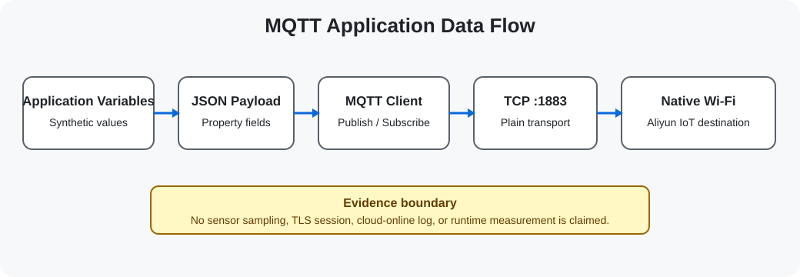

# 无线连接与 IoT 嵌入式实验室
## Wireless & IoT Embedded Lab

基于 JieLi AC791N/WL82 原生 Wi-Fi 与 Bluetooth 平台，围绕 Classic SPP、lwIP TCP、MCU-side MQTT 与 Aliyun IoT 设备通信组织的嵌入式无线工程仓库。

<p align="center">
  
</p>

## 👋 项目简介 | Overview

仓库以 AC791N/WL82 芯片原生无线能力为起点，保留 DevKitBoard connectivity 主线的应用层、配置和必要接口快照。主线沿 Native Wi-Fi STA、lwIP TCP、MQTT Publish/Subscribe 和 Aliyun IoT 数据通路展开；Classic Bluetooth EDR/SPP 是同一平台上的另一条设备通信路径。

公开快照不是完整 vendor SDK，也不是可脱离 JieLi 工具链独立构建的发行包。凭据字面量已在首次提交前替换为公开占位符。

## ⚙ 技术范围 | Technical Scope

### Native Wireless Platform

- JieLi AC791N / WL82, pi32v2 R3
- Native Wi-Fi STA and Bluetooth radio stack
- Classic Bluetooth EDR / SPP enabled in the selected mainline configuration
- BLE GATT retained as a separate reference; disabled in the mainline configuration

### Network & Protocol

- Wi-Fi state and DHCP events
- lwIP socket interface and TCP client
- MCU-side MQTT client
- Publish / Subscribe, QoS 1, Keep Alive and reconnect flow
- Aliyun IoT topics and application payload path

### Runtime

- FreeRTOS V9.0.0 through the vendor OS abstraction
- Wireless event handling and network worker threads
- Plain TCP port 1883 in the selected MQTT path; no mainline TLS evidence

## 🧠 连接架构 | Connectivity Architecture

```text
Application Variables
        ↓
JSON / MQTT Payload
        ↓
MQTT Client
        ↓
TCP / lwIP
        ↓
Native Wi-Fi
        ↓
AC791N / WL82 Radio
```

Classic Bluetooth SPP 经由同一芯片平台的 EDR stack 提供数据通道，不经过 MQTT/TCP 主线。详见 [Wireless Platform](docs/wireless-platform.md) 和 [Bluetooth Classic](docs/bluetooth-classic.md)。

## 📡 无线与网络 | Wireless & Networking

- [Native Wi-Fi](docs/wifi-networking.md)：STA 配置、连接状态、DHCP 成功事件与 AP/provisioning reference。
- [TCP & lwIP](docs/tcp-and-lwip.md)：socket 注册、连接、收发与 Wi-Fi 就绪条件。
- [Classic Bluetooth SPP](docs/bluetooth-classic.md)：SPP 状态、接收、发送与流控回调。
- [BLE GATT Reference](docs/ble-reference.md)：GATT client 匹配、Read/Write 与 Notify/Indicate 参考路径。

## ☁ MQTT 与云端数据 | MQTT & Cloud Data

<p align="center">
  
</p>

示例 payload 使用软件变量构造 temperature / humidity 字段，用于观察 MQTT 数据通路。它不是真实温湿度传感器采样证据。详见 [MQTT & Aliyun IoT](docs/mqtt-and-aliyun.md)。

## 🚀 工程入口 | Project Entry Points

### [Connectivity Mainline](projects/01-connectivity-mainline/)

DevKitBoard 主线快照：Native Wi-Fi STA、TCP client、MCU-side MQTT/Aliyun 与 Classic EDR/SPP。

`Wi-Fi STA / DHCP / lwIP / TCP / MQTT / Aliyun IoT / Classic SPP`

### [BLE GATT Reference](projects/reference/ble-gatt/)

BLE GATT client 的 UUID 匹配、Characteristic Read/Write 与 Notification/Indication 参考。

`BLE / GATT / Reference`

### [Wi-Fi AP & Provisioning Reference](projects/reference/wifi-ap-provisioning/)

官方 Wi-Fi 模式与事件处理快照，用于界定 STA、AP 与 provisioning 入口。

`Wi-Fi / AP / Provisioning / Reference`

## 📂 仓库结构 | Repository Structure

```text
Wireless-IoT-Embedded-Lab/
├── assets/images/           # 自有技术结构图
├── docs/                   # 无线、网络、MQTT、RTOS 与安全边界
├── projects/
│   ├── 01-connectivity-mainline/
│   └── reference/
│       ├── ble-gatt/
│       └── wifi-ap-provisioning/
├── third_party/licenses/   # 已选第三方文件对应的许可证据
├── SOURCE_SELECTION_MANIFEST.csv
└── MIGRATION_HASH_VERIFICATION.csv
```

## 🛠 开发环境 | Development Environment

- JieLi AC791N / WL82 platform
- pi32v2 Clang/LLVM vendor toolchain
- Makefile / Code::Blocks project organization in the original SDK
- FreeRTOS V9.0.0 through vendor OS APIs

当前机器未发现 JieLi pi32v2 工具链，本阶段未执行自动构建、烧录或无线连接。详见 [Development Environment](docs/development-environment.md)。

## 📖 技术文档 | Documentation

- [Wireless Platform](docs/wireless-platform.md)
- [Bluetooth Classic SPP](docs/bluetooth-classic.md)
- [BLE GATT Reference](docs/ble-reference.md)
- [Wi-Fi Networking](docs/wifi-networking.md)
- [TCP & lwIP](docs/tcp-and-lwip.md)
- [MQTT & Aliyun IoT](docs/mqtt-and-aliyun.md)
- [FreeRTOS Integration](docs/freertos-integration.md)
- [Security Boundaries](docs/security-boundaries.md)
- [Development Environment](docs/development-environment.md)

## 📜 来源与许可 | License

仓库新编写的 README、技术文档和 SVG 适用根目录 [LICENSE](LICENSE)。选中的 vendor / third-party 文件继续受其原始许可条款和文件头约束，详见 [THIRD_PARTY_NOTICES.md](THIRD_PARTY_NOTICES.md)。
