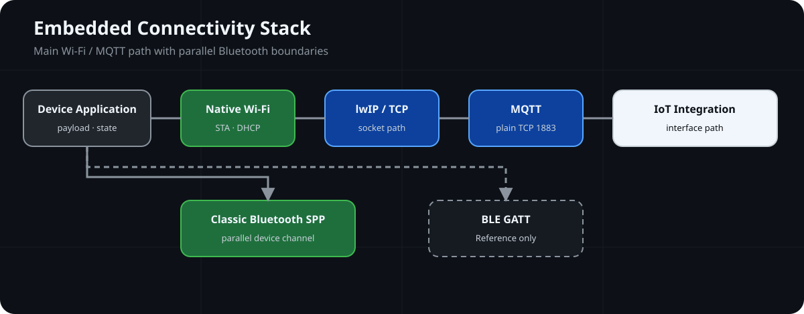
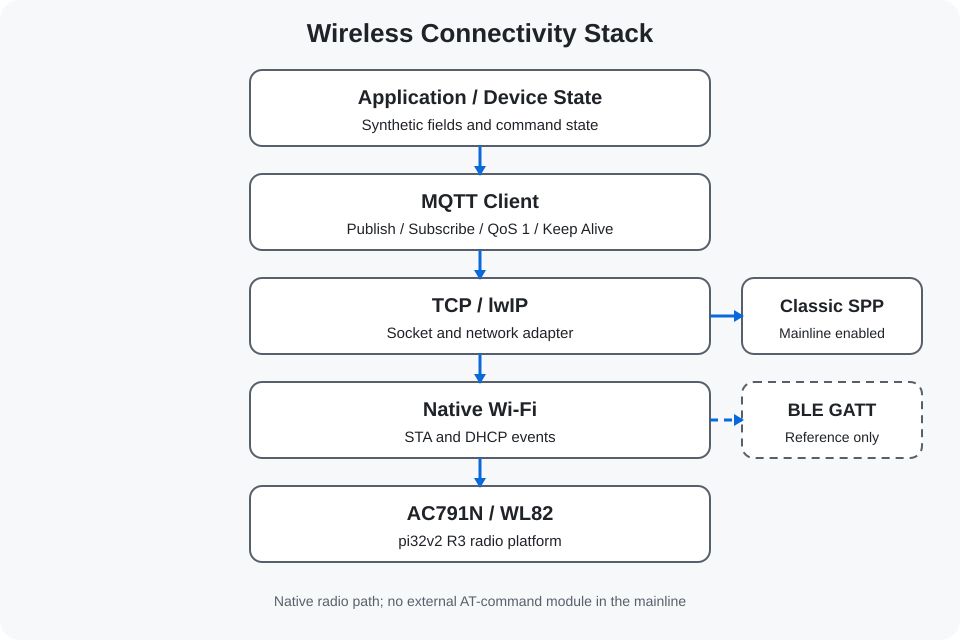

# Wireless-IoT-Embedded-Lab

基于 JieLi AC791N / WL82 平台的嵌入式无线与 IoT Integration 实践仓库，重点展示 Native Wi-Fi、lwIP、TCP、MQTT 和设备侧数据通路。

**📡 Connectivity Stack**



## Connectivity Snapshot

| Connectivity Focus | Current Scope |
| --- | --- |
| Device Platform | JieLi AC791N / WL82、pi32v2 R3 |
| Network Stack | Native Wi-Fi → lwIP → TCP |
| MQTT Transport | Plain TCP 1883；no TLS / MQTTS claim |
| Parallel Path | Classic Bluetooth EDR/SPP；BLE GATT is Reference only |
| Evidence | Source and interface review；build, connection and runtime evidence not provided |

> 📨 **Evidence:** Connectivity paths documented · Build, wireless connection, and runtime evidence not provided

## 📌 Overview

仓库围绕 AC791N / WL82 芯片原生 Wi-Fi 与 Bluetooth 能力组织应用和接口代码。主线使用 Native Wi-Fi STA、DHCP 事件、lwIP socket、TCP 和 MCU-side MQTT 连接 IoT 服务，并保留 Classic Bluetooth EDR/SPP 作为并列通信路径。

BLE GATT、Wi-Fi AP、scan 和 provisioning 仅作为独立 Reference，不属于主线当前启用功能。仓库用于说明无线软件栈、网络传输和 IoT 接口之间的关系，不描述为完整、商业化或已经在线验证的 IoT 产品。

## 🏗️ Architecture



### 🌐 Network Path

主线网络能力按以下层次连接：

```text
Native Wi-Fi
      ↓
lwIP
      ↓
TCP
      ↓
MQTT
      ↓
IoT Integration
```

Application 通过 MQTT client 和 lwIP socket wrapper 进入 Native Wi-Fi；Classic Bluetooth EDR/SPP 使用芯片原生 Bluetooth stack，与 MQTT/TCP 路径并列。BLE GATT 只保留 Reference 入口，不改变主线中 BLE 未启用的事实。

## ✨ Key Features

| Capability | Implementation Entry |
| --- | --- |
| Native Wi-Fi integration | [Wireless Platform](docs/wireless-platform.md) 与 [Native Wi-Fi Networking](docs/wifi-networking.md) 说明 STA、DHCP 事件和网络就绪状态 |
| lwIP TCP communication | [TCP and lwIP](docs/tcp-and-lwip.md) 展示 socket wrapper、TCP client 和网络状态检查 |
| MQTT transport | [MQTT and Aliyun IoT](docs/mqtt-and-aliyun.md) 展示 Connect、Subscribe、Publish、Yield 和 reconnect 路径 |
| IoT service integration | [Mainline Connectivity Project](projects/01-connectivity-mainline/) 连接 JSON payload、MQTT topic 和 Aliyun IoT 接口 |
| Bluetooth boundary | [Classic Bluetooth SPP](docs/bluetooth-classic.md) 是主线通道；[BLE GATT](docs/ble-reference.md) 明确标记为 Reference |

主线 MQTT 使用 plain TCP 1883，不包含 MQTTS、TLS session 或证书校验。示例中的 temperature 和 humidity 来自软件变量，仅用于呈现数据通路，不是传感器采样证据。

## 📂 Project Structure

```text
Wireless-IoT-Embedded-Lab/
├── projects/01-connectivity-mainline/       # Native Wi-Fi、TCP、MQTT 与 Classic SPP 主线
├── projects/reference/ble-gatt/             # BLE GATT Reference
├── projects/reference/wifi-ap-provisioning/ # AP、scan 与 provisioning Reference
├── docs/                                    # 无线、网络、MQTT、RTOS 与安全边界
├── third_party/licenses/                    # 已保留的第三方许可文本
└── assets/images/                           # 已有自绘架构与数据流 SVG
```

## 📚 Documentation

- [Wireless Platform](docs/wireless-platform.md)
- [Native Wi-Fi Networking](docs/wifi-networking.md)
- [TCP and lwIP](docs/tcp-and-lwip.md)
- [MQTT and Aliyun IoT](docs/mqtt-and-aliyun.md)
- [Classic Bluetooth SPP](docs/bluetooth-classic.md)
- [BLE GATT Reference](docs/ble-reference.md)
- [FreeRTOS Integration](docs/freertos-integration.md)
- [Security Boundaries](docs/security-boundaries.md)
- [Development Environment](docs/development-environment.md)

## 🧪 Verification

### 💻 Host Test

**Status:** Not Applicable. 仓库没有独立的 Host Test 入口。

### 🔨 Build Verification

**Status:** Not Provided. 工程和构建入口存在，但仓库未提供与当前公开版本对应的 pi32v2 工具链构建记录。

### 🔌 Hardware Validation

**Status:** Not Provided. 仓库未提供可复核的 Wi-Fi、Classic Bluetooth 或 BLE 板端验证记录。

### 📊 Runtime Evidence

**Status:** Not Provided. 仓库未提供 DHCP、TCP、MQTT、Aliyun IoT 或 Bluetooth 连接日志作为运行证据。

源码中的网络状态、MQTT 调用和 payload 字段不等同于构建成功、无线连接完成或云端服务在线验证。

## License Boundary

根目录 [LICENSE](LICENSE) 仅适用于仓库新增并明确覆盖的 README、技术文档和自绘 SVG。JieLi vendor 文件、MQTT 接口、FreeRTOS 组件及其他第三方内容继续适用原有文件头和许可条款，具体边界见 [THIRD_PARTY_NOTICES.md](THIRD_PARTY_NOTICES.md)。
